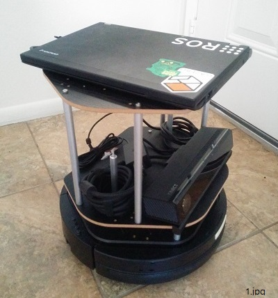
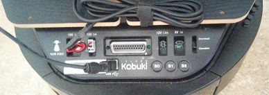
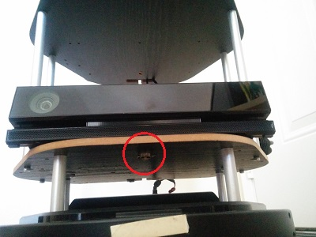

# sulcata

## Description
A robot integration project by using Ubuntu 14.04, ROS Indigo, Kobuki (Turtle Bot), and Kinect v2. ([for Korean](README_kr.md))

Users can:
- see the easiest way to build a ROS based robot.
- know the essential hardware/software for SLAM and navigation project.
- have scripts to launch the required ROS apps.

This project can be useful for developers who have Kinect v2 instead of Kinect v1 or Xtion. 

(Sulcata is a species of tortoise. Since this project is a variation of Turtle Bot, I named it as Sulcata project. (<a href="https://en.wikipedia.org/wiki/African_spurred_tortoise" target="_blank">see also</a>))

## Maintainer
- [SJ Kim](http://bus710.net)<<bus710@gmail.com>>

## Table of contents
- [Description](#description)
- [Hardware setting](#hardware-setting)
- [Software setting](#software-setting)
- [Launch](#launch)
- [Todo list](#todo-list)
- [Reference](#todo)

## Hardware setting
Altough you need a slodering and drilling process to build this, I would like to say this is relatively easy. :)  




    

- The image 1 shows the entire setting for this project. Kobuki has its own buying option, which is wooden panel and aluminum poles so that we can utilize the materials to support Kinect and PC.  
- The image 2 shows the electrical connection between Kobuki Kinect, and PC. Since Kinect v2 requires more power input than v1, I intentionally connected Kinect v2 to 12V/5A output as power source. If you cut Kinect's power code, there are two braided cables between shields. The braided cables are the actual power path for Kinect v2. However, please check which is positive and negative by using DMM. Also in order to connect the cable to Konuki, you need a special plug, which is "Molex PN : 5566-02B2".   
- The image 3 shows the USB connection between PC, Kobuki, and Kinect. Especially Kinect v2 requires USB 3.0 so that the PC should have a decent port.   
- The image 4 shows the way to attach Kinect v2 on the wooden panel. Since Kinect v2 has a famale socket, which is compatible to typical tripod, you can buy a 1/4 inch camera mounting screw for that ([see also: amazon](http://www.amazon.com/Smallrig%C2%AE-Screw-Adapter-Quick-Release/dp/B006GB5MDW)). You also need to make a hole on the panel because the diameter of camera mounting bolt is thicker than the holes on the wooden panel. (It is around 10 mm.)

The PC in the pictures has Intel's x86-64 CPU, HD4000 GPU, and 8GB RAM. It is common spec for nowadays buying options (Actually, it is slightly outdated spec). Just make sure it is Ubuntu 14.04 compatible system.   

## Software setting
The software stack you will use rely on Ubuntu 14.04. Thus I assume that you already installed Ubuntu 14.04 on your PC/Laptop.  

Now you can follow below installation steps.  

- Install ROS Indigo desktop full version. ([see also](http://wiki.ros.org/indigo/Installation/Ubuntu))
```
sudo sh -c 'echo "deb http://packages.ros.org/ros/ubuntu $(lsb_release -sc) main" > /etc/apt/sources.list.d/ros-latest.list'
sudo apt-key adv --keyserver hkp://ha.pool.sks-keyservers.net --recv-key 0xB01FA116
sudo apt-get update
sudo apt-get install ros-indigo-desktop-full
sudo rosdep init
rosdep update
echo "source /opt/ros/indigo/setup.bash" >> ~/.bashrc
source ~/.bashrc
sudo apt-get install python-rosinstall
```

- Set up ROS environment.
```
cd ~
mkdir catkin_ws
cd catkin_ws
catkin_make  

echo "source $HOME/catkin_ws/devel/setup.bash" >> ~/.bashrc
echo "alias cw='cd ~/catkin_ws'"
echo "alias cs='cd ~/catkin_ws/src'"
echo "alias cm='cw && catkin_make'"
source ~/.bashrc
```

- Install Kobuki packages ([see also]())
```
sudo apt-get install ros-indigo-kobuki\*  
```

- Install urg_node package ([see also]())
```
sudo apt-get install ros-indigo-urg-node 
```

- Install depthimage-to-laserscan package ([see also]())
```
sudo apt-get install ros-indigo-depthimage-to-laserscan
```

- Install rosbook_kobuki repository ([see also]())
```
cw
git clone https://github.com/oroca/rosbook_kobuki.git
cm
```

- Modify kobuki_slam.launch ([see also]())
```
aaa
```

- Install libfreenect2 package ([see also]())
```

```

- Install iai_kinect2 package ([see also]())
```
aa
```


## Launch

## Todo list

## Reference

