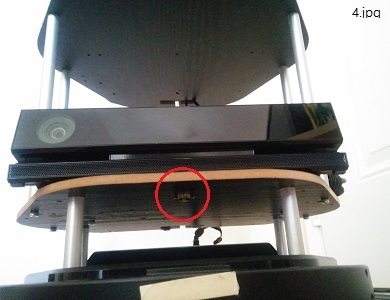

# sulcata

## Description
A robot integration project by using ROS, Kobuki (Turtle Bot), and Kinect v2. ([for Korean](README_kr.md))

Users can:
- see the easiest way to build a ROS based robot.
- know the essential hardware/software for SLAM and navigation project.
- have scripts to launch the required ROS apps.

This can be useful for developers who have Kinect v2 instead of Kinect v1 or Xtion.  
(Sulcata is a species of tortoise. Since this project is a variation of Turtle Bot, I named it as sulcata project. (<a href="https://en.wikipedia.org/wiki/African_spurred_tortoise" target="_blank">see also</a>))

## Maintainer
- [SJ Kim](http://bus710.net)<<bus710@gmail.com>>

## Table of contents
- [Description](#description)
- [Hardware](#hardware)
- [Software](#software)
- [Launch](#launch)
- [Todo](#todo)

## Hardware
The image 1 shows the entire setting for this project. Kobuki has its own buying option, which is wooden panel and aluminum poles so that we can utilize the materials to support Kinect and PC.  
The image 2 shows the electrical connection between Kobuki Kinect, and PC. Since Kinect v2 requires more power input than v1, I intentionally connected Kinect v2 to 12V/5A output as power source. If you cut Kinect's power code, there are two braided cable between shields. The braided cable is the actual power path for Kinect v2. However, please check which is positive and negative by using DMM. Also in order to connect the cable to Konuki, you need a special plug, which is "Molex PN : 5566-02B2". 
The image 3 shows the USB connection between PC, Kobuki, and Kinect. Especially Kinect v2 requires USB 3.0 so that the PC should have a decent port. 
The image 4 shows the way to attach Kinect v2 on the wooden panel. Since Kinect v2 has a famale socket, which is compatible to typical tripod so that you can buy a 1/4 inch camera mounting screw for that ([see also:amazon](http://www.amazon.com/Smallrig%C2%AE-Screw-Adapter-Quick-Release/dp/B006GB5MDW))

## Software

## Launch

## Todo

