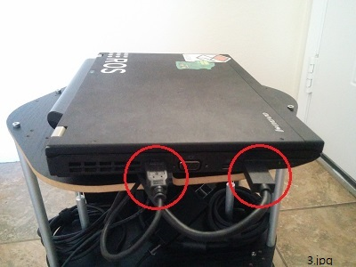

# sulcata

## Description
본 프로젝트는 우분투14.04, ROS 인디고, 거북이 로봇, 키넥트 v2를 활용하는 한 예를 제시하고자 작성 되었습니다. ([for International](README.md))

사용자들은 다음을 목표로 본 프로젝트를 활용할 수 있습니다.
- ROS 기반 로봇 제작에 있어서 최대한 간단하고 빠른 방법을 제시합니다.  
- SLAM과 네비게이션 프로젝트를 위한 최소한의 구성이 어떤지 확인 할 수 있습니다. 
- ROS 어플들을 실행하기 위한 간단한 명령어들을 제시 합니다. 

This project can be useful for developers who have Kinect v2 instead of Kinect v1 or Xtion. 

(Sulcata is a species of tortoise. Since this project is a variation of Turtle Bot, I named it as Sulcata project. (<a href="https://en.wikipedia.org/wiki/African_spurred_tortoise" target="_blank">see also</a>))

## Maintainer
- [SJ Kim](http://bus710.net)<<bus710@gmail.com>>

## Table of contents
- [Description](#description)
- [Hardware setting](#hardware-setting)
- [Software setting](#software-setting)
- [Launch](#launch)
- [Launch (alternative)] (#launch-alternative)
- [Todo list](#todo-list)
- [Reference](#reference)

## Hardware setting
Altough you need a slodering and drilling process to build this, I would like to say this is relatively easy. :)  



    

- The image 1 shows the entire setting for this project. Kobuki has its own buying option, which is wooden panel and aluminum poles so that we can utilize the materials to support Kinect and PC.  
- The image 2 shows the electrical connection between Kobuki Kinect, and PC. Since Kinect v2 requires more power input than v1, I intentionally connected Kinect v2 to 12V/5A output as power source. If you cut Kinect's power code, there are two braided cables between shields. The braided cables are the actual power path for Kinect v2. However, please check which is positive and negative by using DMM. Also in order to connect the cable to Konuki, you need a special plug, which is "Molex PN : 5566-02B2".   
- The image 3 shows the USB connection between PC, Kobuki, and Kinect. Especially Kinect v2 requires USB 3.0 so that the PC should have a decent port.   
- The image 4 shows the way to attach Kinect v2 on the wooden panel. Since Kinect v2 has a famale socket, which is compatible to typical tripod, you can buy a 1/4 inch camera mounting screw for that ([see also: amazon](http://www.amazon.com/Smallrig%C2%AE-Screw-Adapter-Quick-Release/dp/B006GB5MDW)). You also need to make a hole on the panel because the diameter of camera mounting bolt is thicker than the holes on the wooden panel. (It is around 10 mm.)

The PC in the pictures has Intel's x86-64 CPU, HD4000 GPU, and 8GB RAM. It is common spec for nowadays buying options (Actually, it is slightly outdated spec). Just make sure it is Ubuntu 14.04 compatible system.   

## Software setting
The software stack you will use rely on Ubuntu 14.04. Thus I assume that you already installed Ubuntu 14.04 on your PC/Laptop.  

Now you can follow below installation steps.  

- Install ROS Indigo desktop full version. ([see also](http://wiki.ros.org/indigo/Installation/Ubuntu))
```
sudo sh -c 'echo "deb http://packages.ros.org/ros/ubuntu $(lsb_release -sc) main" > /etc/apt/sources.list.d/ros-latest.list'
sudo apt-key adv --keyserver hkp://ha.pool.sks-keyservers.net --recv-key 0xB01FA116
sudo apt-get update
sudo apt-get install ros-indigo-desktop-full

sudo rosdep init
rosdep update
echo "source /opt/ros/indigo/setup.bash" >> ~/.bashrc
source ~/.bashrc
sudo apt-get install python-rosinstall
```

- Set up ROS environment.
Once you finish ROS installation, catkin work space should be set. Also some bashrc settings can be added for convenience.
```
cd ~
mkdir catkin_ws
cd catkin_ws
catkin_make  

echo "source $HOME/catkin_ws/devel/setup.bash" >> ~/.bashrc
echo "alias cw='cd ~/catkin_ws'"
echo "alias cs='cd ~/catkin_ws/src'"
echo "alias cm='cw && catkin_make'"
source ~/.bashrc
```

- Install Kobuki packages ([see also](http://wiki.ros.org/turtlebot))
These packackges provides several features for both running and sumulating Kobuki. 
```
sudo apt-get install ros-indigo-kobuki* 
```

- Install urg_node package ([see also](http://wiki.ros.org/urg_node))
Although this package is designed for 2D LRF sensor, you can leverage for your Konect2
```
sudo apt-get install ros-indigo-urg-node 
```

- Install depthimage-to-laserscan package ([see also](http://wiki.ros.org/depthimage_to_laserscan))
This package is the key to convert Kinect's 3D data to 2D data to make map around your robot.
```
sudo apt-get install ros-indigo-depthimage-to-laserscan
```

- Install rosbook_kobuki repository ([see also](https://github.com/oroca/rosbook_kobuki.git))
This package, which is developed by Dr.Pyo, is the core of various Kobuki based SLAM and navigation projects. 
```
cs
git clone https://github.com/oroca/rosbook_kobuki.git
cm
```

- Modify kobuki_slam.launch ([see also](http://cafe.naver.com/openrt/11728))  
Since 'kobuki_slam' was originally designed for 2D LRF data, you should modify a launch file, whici is 'kobuki_slam.launch' in the repository. The lines, which is related to "urg_node", should be commentted.
```
<launch>
#<node pkg="urg_node" type="urg_node" name="kobuki_urg_node" output="screen">
	#<param name="frame_id" value="base_scan" />
#</node>
<node pkg="kobuki_tf" type="kobuki_tf" name="kobuki_tf" output="screen">
</node>
``` 

- Install libfreenect2 package ([see also](https://github.com/OpenKinect/libfreenect2))
This package provides a driver and a test application for Kinect v2. In order to take advantage of GPGPU, this package's installation steps explain for several GPUs from different vendors such as Nvidia-GTX/Tegra, AMD-Radeon, Intel-HD, ARM-Mali. However, below lines only show for Intel-HD GPUs. 
```
# download & install
cd
git clone https://github.com/OpenKinect/libfreenect2.git
cd libfreenect2
cd depends; ./download_debs_trusty.sh
sudo apt-get install build-essential cmake pkg-config
sudo dpkg -i debs/libusb*deb
sudo apt-get install libturbojpeg libjpeg-turbo8-dev
sudo dpkg -i debs/libglfw3*deb; sudo apt-get install -f; sudo apt-get install libgl1-mesa-dri-lts-vivid
sudo apt-add-repository ppa:floe/beignet; sudo apt-get update; sudo apt-get install beignet-dev; sudo dpkg -i debs/ocl-icd*deb
sudo dpkg -i debs/{libva,i965}*deb; sudo apt-get install -f
sudo apt-get install libopenni2-dev

# build
cd ..
mkdir build && cd build
cmake .. -DCMAKE_INSTALL_PREFIX=$HOME/freenect2
make
make install

# test (unplug Kinect v2 USB code and plug it again.) 
sudo cp ../platform/linux/udev/90-kinect2.rules /etc/udev/rules.d/
./bin/Protonect
```

- Install iai_kinect2 package ([see also](https://github.com/code-iai/iai_kinect2))
In order to connect freenect2 driver and ROS, you should install this package. 
```
cd ~/catkin_ws/src/
git clone https://github.com/code-iai/iai_kinect2.git
cd iai_kinect2
rosdep install -r --from-paths .
cd ~/catkin_ws
catkin_make -DCMAKE_BUILD_TYPE="Release"
```

## Launch
Now, the stack is ready to run 'kobuki_slam'. If the hardware and software are well installed, you can see the image attahced below. Each command should be run in new terminals (or tmux). If you use a better GPU than mine (HD5200 or later), you can change 'sd' to 'hd' or 'qhd' from the line for 'depthimage_to_laserscan'.
```
# launch apps in target system 
roscore
roslaunch kobuki_node minimal.launch --screen
roslaunch kinect2_bridge kinect2_bridge.launch publish_tf:=true
rosrun depthimage_to_laserscan depthimage_to_laserscan image:=/kinect2/sd/image_depth_rect _output_frame_id:=/base_scan
roslaunch kobuki_slam kobuki_slam.launch
rosrun rviz rviz -d `rospack find kobuki_slam`/rviz/kobuki_slam.rviz 

# launch apps in remote system
roslaunch kobuki_keyop keyop.launch
```

## Launch (alternative)
Since the launch commands are pretty complex, this repository provides simple scripts in the scripts directory.
```
# install this repository in target system
cd ~/Download
git clone https://github.com/bus710/sulcata
cd scripts

# launch apps in target system
roscore
./01_kobuki
./02_kinect_bridge
./03_depth_laserscan
./04_kobuki_slam
./05_rviz

# launch apps in remote system
./09_keyop
```


## Todo list
Now you have the working sample for your project. What will you try after this? I might try these goals in the future. If you are interested or want to suggest something, please do PR or leave issues.  
- Actual SLAM and navigation usage will be written.
- Modify for Ubuntu 16.04.
- Trouble shooting for issues.  

## Reference
[1] http://wiki.ros.org/Books/ROS_Robot_Programing   
[2] https://github.com/oroca/rosbook_kobuki  
[3] https://github.com/OpenKinect/libfreenect2  
[4] https://github.com/code-iai/iai_kinect2  
[5] http://wiki.ros.org/turtlebot  


