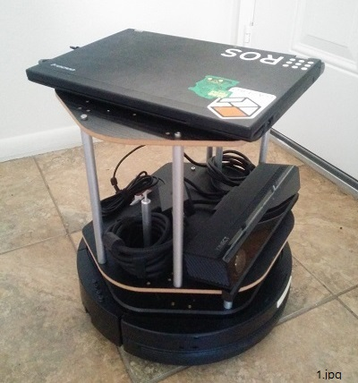
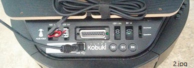

# sulcata

## Description
본 프로젝트는 우분투14.04, ROS 인디고, 거북이 로봇, 키넥트 v2를 활용하는 한 예를 제시하고자 작성 되었습니다. ([for International](README.md))

본 프로젝트는: 
- ROS 기반 로봇 제작에 있어서 최대한 간단하고 빠른 방법을 제시합니다.  
- SLAM과 네비게이션 프로젝트를 위한 최소한의 구성이 어떤지 확인 할 수 있습니다. 
- ROS 어플들을 실행하기 위한 간단한 명령어들을 제시 합니다. 

특히 키넥트 v1 또는 xtion 등의 비교적 구하기 어려운 RGBD 카메라를 키넥트 v2로 대체하고자 하는 분들께 도움이 될 수 있습니다.

(설카타는 육지 거북의 한 종류 입니다. 이 프로젝트가 다양한 거북이 로봇의 한 구현 예인 것에 착안하여 채택하였습니다. (<a href="https://en.wikipedia.org/wiki/African_spurred_tortoise" target="_blank">see also</a>))

## Maintainer
- [김성준](http://bus710.net) <<bus710@gmail.com>>

## Table of contents
- [Description](#description)
- [Requirement](#requirement)
- [Hardware setting](#hardware-setting)
- [Software setting](#software-setting)
- [Launch](#launch)
- [Launch (alternative)] (#launch-alternative)
- [Todo list](#todo-list)
- [Reference](#reference)

## Requirement
본 프로젝트에서는 아래와 같은 특정 하드웨어와 공구를 필요로 합니다.
- 컴퓨터: 인텔 호환 CPU, HD4000 또는 그 이후의 GPU, 4GB 이상의 RAM, 32GB 이상의 하드디스크
- 키넥트 v2
- 거북이
- 거북이 지지대 세트
- 카메라 고정용 볼트
- Molex PN : 5566-02B2
- 납땜 공구
- 드릴 공구

## Hardware setting  
드릴과 납땜하는 과정을 최소한으로 줄이도록 노력 했습니다. 공구와 간단한 관련 지식이 있다면 30분 안에 모든 과정을 마칠 수 있습니다.




    

- 첫번째 이미지는 완성 되었을 때의 모습 입니다. 거북이를 구입할 때 옵션으로써 나무 패널과 알루미늄 지지대를 함께 구입할 수 있습니다. 그 위에 키넥트와 노트북을 올림으로써 쉽게 시스템을 구성할 수 있습니다.
- 두번째 이미지는 키넥트와 거북이, 컴퓨터 간의 결선을 보여줍니다. 키넥트v1에 비해 v2는 더 많은 전력을 요구하는 것으로 알려져 있기에 여기서는 거북이의 12V/5A 출력을 키넥트의 전원으로 사용하기로 했습니다. v2의 전원선을 잘라보면 예상과는 다르게, 둘로 나뉘어진 그물 케이블만으로 구성 된 것을 확인할 수 있습니다. 그것이 각각 + 전압과 GND 선인 것을 테스터기로 확인할 수 있습니다. 따라서 그 부분을 납땜을 통해 준비된 커넥터 (Molex PN : 5566-02B2)에 연결함으로써 쉽게 거북이에 연결할 수 있습니다. 납땜은 이것으로 끝!  
- 세번째 이미지는 컴퓨터와 거북이, 키넥트가 각각 USB 케이블로 연결 된 것을 보여 줍니다. 주의할 점은, 키넥트v2의 특성 상, USB 3.0 단자를 사용해 주어야 한다는 점 입니다.
- 네번째 이미지는 키넥트를 패널에 고정하는 방법을 보여 줍니다. 키넥트v2는 하단에 너트 소켓이 있는데, 일반적인 카메라 삼각대와 호환되는 사이즈 입니다. 따라서, 패널에 적절한 직경(10 mm)의 구멍을 내주고, 카메라 마운트용 볼트로 쉽게 고정해 줄 수 있습니다 ([구입처](http://www.amazon.com/Smallrig%C2%AE-Screw-Adapter-Quick-Release/dp/B006GB5MDW)).

추가로, 본 예제에 사용된 컴퓨터는 인텔의 3세대 I5 모바일 CPU, 내장 그래픽 HD4000, 8GB의 램으로 구성 되었습니다. 요즘에 있어서는 크게 고사양은 아니지만, 어쨋거나 반드시 우분투 14.04와 호환이 잘 되는 시스템을 사용하시길 권장 합니다.  

## Software setting
본 프로젝트는 우분투 14.04에 의존하고 있습니다. 따라서 독자들께서 이미 우분투 14.04를 설치/사용하고 있는 것을 가정하도록 하겠습니다. 

아래에서는 주요 소프트웨어를 설치하는 방법을 최대한 간단히 안내 합니다만, 가급적이면 한번쯤은 관련 웹페이지를 확인하시길 추천 드립니다.

- Install ROS Indigo desktop full version ([see also](http://wiki.ros.org/indigo/Installation/Ubuntu))  
일단 ROS를 설치하는 방법 입니다. 설치에 큰 어려움은 없겠지만, 저장소의 키 값이 종종 바뀌거나 모종의 이유로 다운로드가 불가능할 경우가 있습니다. 그럴 때는 원래의 가이드에서 키값을 다시 확인하거나, 나중에 설치함으로써 해결할 수 있습니다.
```
sudo sh -c 'echo "deb http://packages.ros.org/ros/ubuntu $(lsb_release -sc) main" > /etc/apt/sources.list.d/ros-latest.list'
sudo apt-key adv --keyserver hkp://ha.pool.sks-keyservers.net --recv-key 0xB01FA116
sudo apt-get update
sudo apt-get install ros-indigo-desktop-full

sudo rosdep init
rosdep update
echo "source /opt/ros/indigo/setup.bash" >> ~/.bashrc
source ~/.bashrc
sudo apt-get install python-rosinstall
```

- Set up ROS environment   
ROS의 설치를 마치면, ROS 앱을 다운 받고 컴파일하는 장소를 마련해야 합니다. 또한 단축키를 추가하는 방법도 적어 두었습니다.
```
cd ~
mkdir catkin_ws
cd catkin_ws
catkin_make  

echo "source $HOME/catkin_ws/devel/setup.bash" >> ~/.bashrc
echo "alias cw='cd ~/catkin_ws'"
echo "alias cs='cd ~/catkin_ws/src'"
echo "alias cm='cw && catkin_make'"
source ~/.bashrc
```

- Install Kobuki packages ([see also](http://wiki.ros.org/turtlebot))  
거북이 패키지는 실제 거북이 로봇  또는 시뮬레이터 상의 거북이를 제어하기 위한 드라이버와 어플리케이션을 포함하고 있습니다. 
```
sudo apt-get install ros-indigo-kobuki
rosrun kobuki_ftdi create_udev_rules
```

- Install urg_node package ([see also](http://wiki.ros.org/urg_node))  
이 패키지는 본래 2D LRF 센서를 위한 패키지이지만  상위 SLAM 패키지가 의존하는 대상이기에 반드시 필요 합니다. 
```
sudo apt-get install ros-indigo-urg-node 
```

- Install depthimage-to-laserscan package ([see also](http://wiki.ros.org/depthimage_to_laserscan))  
이 패키지는 키넥트가 출력하는 3D 이미지 데이터를 마치 LRF 센서가 출력하는 2D 이미지인 것 처럼 바꿔주는 역할을 합니다. 
```
sudo apt-get install ros-indigo-depthimage-to-laserscan
```

- Install rosbook_kobuki repository ([see also](https://github.com/oroca/rosbook_kobuki.git))  
이 저장소는 오로카의 표윤석 박사가 개발하였으며, 거북이를 이용한 SLAM또는 네비게이션을 위한 Kobuki_slam이 포함 되어 있습니다. 
```
cs
sudo apt-get install ros-indigo-amcl
sudo apt-get install ros-indigo-gmapping
sudo mknod /dev/ttyACM0 c 166 0
sudo chmod a+rw /dev/ttyACM0
git clone https://github.com/oroca/rosbook_kobuki.git
cm
```

- Modify kobuki_slam.launch ([see also](http://cafe.naver.com/openrt/11728))   
위에 언급한 Kobuki_slam 패키지는 본래 2D LRF를 이용하기 때문에 키넥트를 이용하는 본 프로젝트의 경우에 약간의 파일 수정이 필요 합니다. Kobuki_slam.launch 파일에서 urg_node와 관련된 3줄의 소스코드를 삭제 또는 주석처리 합니다. 
```
<launch>
#<node pkg="urg_node" type="urg_node" name="kobuki_urg_node" output="screen">
	#<param name="frame_id" value="base_scan" />
#</node>
<node pkg="kobuki_tf" type="kobuki_tf" name="kobuki_tf" output="screen">
</node>
``` 

- Install libfreenect2 package ([see also](https://github.com/OpenKinect/libfreenect2))  
이 패키지는 키넥트v2를 위한 드라이버와 테스트용 어플리케이션을 포함합니다. 해당 드라이버가 GPGPU를 이용한 가속에 의존하기 때문에 PC의 그래픽 카드에 따라 설치 방법이 달라지므로 주의가 필요합니다. 여기서는 인텔의 내장 그래픽 카드를 사용하고 있으므로 관련 내용만을 적었습니다.  
```
# download & install
cd
git clone https://github.com/OpenKinect/libfreenect2.git
cd libfreenect2
cd depends; ./download_debs_trusty.sh
sudo apt-get install build-essential cmake pkg-config
sudo dpkg -i debs/libusb*deb
sudo apt-get install libturbojpeg libjpeg-turbo8-dev
sudo dpkg -i debs/libglfw3*deb; sudo apt-get install -f; sudo apt-get install libgl1-mesa-dri-lts-vivid
sudo apt-add-repository ppa:floe/beignet; sudo apt-get update; sudo apt-get install beignet-dev; sudo dpkg -i debs/ocl-icd*deb
sudo dpkg -i debs/{libva,i965}*deb; sudo apt-get install -f
sudo apt-get install libopenni2-dev

# build
cd ..
mkdir build && cd build
cmake .. -DCMAKE_INSTALL_PREFIX=$HOME/freenect2
make
make install

# test 
sudo cp ../platform/linux/udev/90-kinect2.rules /etc/udev/rules.d/
./bin/Protonect
```

- Install iai_kinect2 package ([see also](https://github.com/code-iai/iai_kinect2))  
본 패키지는 freenect가 제공하는 드라이버와 ROS를 연결하는 노드 입니다. 또한 저장소에는 키넥트 캘리브레이션 패키지도 포함 되어 있습니다. 
```
cd ~/catkin_ws/src/
git clone https://github.com/code-iai/iai_kinect2.git
cd iai_kinect2
rosdep install -r --from-paths .
cd ~/catkin_ws
catkin_make -DCMAKE_BUILD_TYPE="Release"
```

## Launch
이제 거북이를 이용한 SLAM을 테스트할 준비가 되었습니다. 모든 하드웨어와 소프트웨어의 설치에 문제가 없었다면 각 노드를 실행함으로써 저 하단에 첨부한 이미지와 같은 모습을 rviz를 통해 확인할 수 있습니다. 각 노드는 개별 터미널 또는 tmux를 통해 실행 되어야 합니다. 또한 사용하시는 그래픽 카드가 HD4000 이상의 성능(HD5200 또는 그 이상)을 가졌다면, 'depthimage_to_laserscan' 노드를 수행할 시에 입력하는 sd 옵션을 hd 또는 qhd로 변경할 수 있습니다. 
```
# launch apps in target system 
roscore
roslaunch kobuki_node minimal.launch --screen
roslaunch kinect2_bridge kinect2_bridge.launch publish_tf:=true
rosrun depthimage_to_laserscan depthimage_to_laserscan image:=/kinect2/sd/image_depth_rect _output_frame_id:=/base_scan
roslaunch kobuki_slam kobuki_slam.launch
rosrun rviz rviz -d `rospack find kobuki_slam`/rviz/kobuki_slam.rviz 

# launch apps in remote system
roslaunch kobuki_keyop keyop.launch
```

## Launch (alternative)
본 저장소에서는 위에 적힌 노드 실행용 명령어를 각각의 셸 파일에 저장한 스크립트 파일을 제공하고 있습니다. git을 통해 본 저장소를 내려 받고, scripts 디렉토리의 셸 파일을 사용하시길 추천 드립니다. 
```
# install this repository in target system
cd ~/Download
git clone https://github.com/bus710/sulcata
cd sulcata/scripts

# launch apps in target system
roscore
./01_kobuki
./02_kinect_bridge
./03_depth_laserscan
./04_kobuki_slam
./05_rviz

# launch apps in remote system
./09_keyop
```


## Todo list
여기까지 잘 되었다면, SLAM과 네비게이션을 실행하기 위한 준비는 끝났습니다. 이제는 본격적으로 자신이 필요한 상위 패키지 또는 자신의 코드를 이용한 ROS 앱을 개발할 차례 입니다.   
  
본 저장소의 이후 목표는:
- 향후 실제 SLAM과 네비게이션과 관련된 내용의 추가
- 우분투 16.04, ROS Kinetic 등과 호환 되는 버전으로 업그레이드
- 기타 트러블 슈팅
등이 진행될 예정 입니다. 

## Etc
freenect2와 USB 초기 설정의 문제로 부팅 후에는 항상 키넥트의 USB 플러그를 뺐다 꽂아야 하는 번거로움이 있습니다.

## Reference
[1] http://wiki.ros.org/Books/ROS_Robot_Programing   
[2] https://github.com/oroca/rosbook_kobuki  
[3] https://github.com/OpenKinect/libfreenect2  
[4] https://github.com/code-iai/iai_kinect2  
[5] http://wiki.ros.org/turtlebot  


